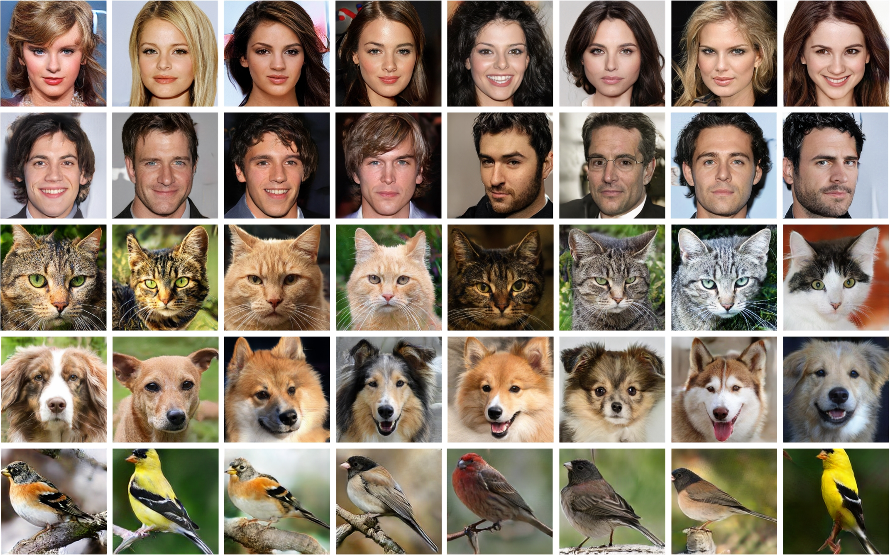

# PFC-UNIT: UNSUPERVISED IMAGE-TO-IMAGE TRANSLATION WITH PRE-TRAINED FINE-GRAINED CLASSIFICATION


This repository provides the official PyTorch implementation for the following paper:

> **PFC-UNIT: UNSUPERVISED IMAGE-TO-IMAGE TRANSLATION WITH PRE-TRAINED FINE-GRAINED CLASSIFICATION**<br>
> **Abstract:** *Unsupervised image-to-image translation has garnered significant
attention in data augmentation by allowing the translation
of images from one domain to another while preserving
their content and style. However, current methods face
a major challenge when these two domains have substantial
discrepancies in shape and appearance. To overcome this
challenge, we introduce a novel framework that can boost
the naturalness and diversity of unsupervised image-to-image
translation with pre-trained fine-grained classification (PFCUNIT).
Specifically, the proposed PFC-UNIT trains a content
encoder to obtain the coarse-level content feature in the first
stage. In the second stage, a new pre-trained fine-grained classification
(PFC) is designed to generate fine-level images with
style consistency. Furthermore, during the latter part of the
second stage, a dynamic skip connection is added to generate
finer-level images with content consistency. Experimental
results show that as a plug-and-play tool, our PFC dramatically
enhances the image translation effect by maintaining
vivid details and keeping content and style consistent. And
the proposed PFC-UNIT outperforms leading state-of-the-art
methods.*

## Installation
This repository is built in PyTorch 1.7.0 and tested on CUDA 10.1. See `environment/PFC-UNIT.yaml` for the installation of dependencies required to run PFC-UNIT.
```bash
# Creat the environment
conda env create -f ./environment/pfcunit_env.yaml
```

## Dataset Preparation

Different datasets (including CelebA-HQ, AFHQ and ImageNet291, which can be downloaded from their official pages) are utilized to complete different image-to-image translation tasks.

| Translation Task | Used Dataset                                                                                                                                                                                                                                                                           | 
|:-----------------|:---------------------------------------------------------------------------------------------------------------------------------------------------------------------------------------------------------------------------------------------------------------------------------------| 
| Male←→Female     | [CelebA-HQ](https://github.com/clovaai/stargan-v2#datasets-and-pre-trained-networks)(divided into male and female subsets by [StarGANv2](https://github.com/clovaai/stargan-v2#datasets-and-pre-trained-networks))                                                                     |
| Dog←→Cat         | [AFHQ](https://github.com/clovaai/stargan-v2#datasets-and-pre-trained-networks)(provided by [StarGANv2](https://github.com/clovaai/stargan-v2#datasets-and-pre-trained-networks))                                                                                                       |
| Face←→Cat        | [CelebA-HQ](https://github.com/switchablenorms/CelebAMask-HQ) and [AFHQ](https://github.com/clovaai/stargan-v2#datasets-and-pre-trained-networks)                                                                                                                                      |
| Bird←→Dog        | 4 classes of birds and 4 classes of dogs in [ImageNet291](https://github.com/williamyang1991/GP-UNIT/tree/main/data_preparation)
| Bird←→Car        | 4 classes of birds and 4 classes of cars in [ImageNet291](https://github.com/williamyang1991/GP-UNIT/tree/main/data_preparation)                                                                                          

## Training Content Encoder of Content Extraction

Train model to get the pretrained model Content Encoder. ( The Content Encoder is obtained as `./checkpoint/content_encoder.pt`.)
```python
python prior_distillation.py --unpaired_data_root UNPAIR_DATA --paired_data_root PAIR_DATA \
                             --unpaired_mask_root UNPAIR_MASK --paired_mask_root PAIR_MASK
```

## Training Find-grained Classifier of Find-grained Classification

To pre-train the fine-grained classifiers, we create a new fine-grained classification dataset, termed FCKaggle. Our FC-Kaggle includes six domains, which are Cat (including 67 fine-grained varieties), Dog (including 120 fine-grained varieties), Bird (including 500 fine-grained varieties), Car (including 19 fine-grained varieties), Age stage (including 10 fine-grained varieties), and Facial expression (including 7 fine-grained varieties).

We provide a Jupyter notebook at `./train_find_grained_classifiers.ipynb` to train the find-grained classifers.

The pre-trained find-grained classifers need to be saved in './classification/FIND_GRAINED_CLASSIFERS.pt`.

## Training PFC-UNIT

Translate a content image to the target domain in the style of a style image by additionally specifying `--style`:
```python
python inference.py --generator_path PRETRAINED_GENERATOR_PATH --content_encoder_path PRETRAINED_ENCODER_PATH \ 
                    --content CONTENT_IMAGE_PATH --style STYLE_IMAGE_PATH --device DEVICE
```

Train model to complete different image-to-image translation tasks. (Translate a content image to the target domain in the style of a style image by additionally specifying `--task_type`. 'The trained model is saved as `./checkpoint/TASK-ITERATIONS.pt`. Intermediate results are saved in `./log/TASK/`.)
```python
python train.py --task TASK --batch BATCH_SIZE --iter ITERATIONS --task_type CLASSIFICATION_TYPE\
                --source_paths SPATH1 SPATH2 ... SPATHS --source_num SNUM1 SNUM2 ... SNUMS \
                --target_paths TPATH1 TPATH2 ... TPATHT --target_num TNUM1 TNUM2 ... TNUMT
```

## Acknowledgments
Our code is inspired by [GP-UNIT](https://github.com/williamyang1991/GP-UNIT/) and [StarGAN v2](https://github.com/clovaai/stargan-v2).
